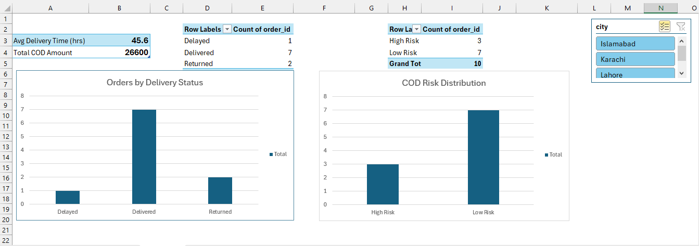

# Logistics Operations Dashboard

## Business Problem
Logistics operations teams need fast visibility into delivery performance,
returns, and cash-on-delivery (COD) risk in order to take timely action.

This project demonstrates how operational data can be transformed into
a simple dashboard for daily decision-making.

---

## Dataset
Order-level logistics data including:
- City
- Delivery time (hours)
- Delivery status
- COD amount

---

## Tools Used
- Excel (data cleaning, pivot tables, pivot charts, dashboard)

---

## Dashboard Overview

The dashboard provides a one-page view of key operational metrics:
- Average delivery time
- Total COD amount
- Orders by delivery status
- High-risk vs low-risk COD orders
- City-level filtering using slicers

---

## Key Insights
- Average delivery time indicates moderate delays that require monitoring.
- Returned and delayed orders represent direct revenue and operational risk.
- A significant portion of COD value is associated with high-risk orders.
- City-based filtering allows operations teams to identify problem areas quickly.

---

## Business Recommendations
- Prioritize follow-up on high-risk COD orders to reduce revenue loss.
- Investigate cities with higher delays or returns.
- Use this dashboard as a daily operations monitoring tool.
- Expand the dashboard with trends over time for proactive decision-making.

---

## Conclusion
This project reflects real-world logistics operations analysis, combining
data cleaning, KPI tracking, and visual reporting to support business decisions.
